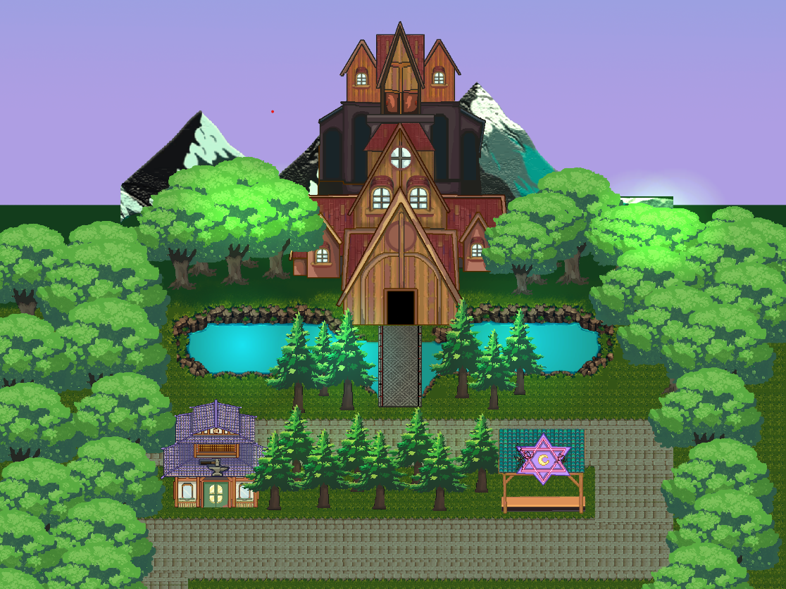
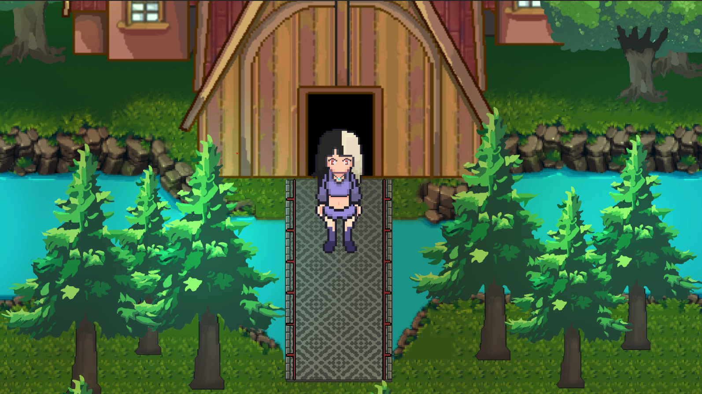
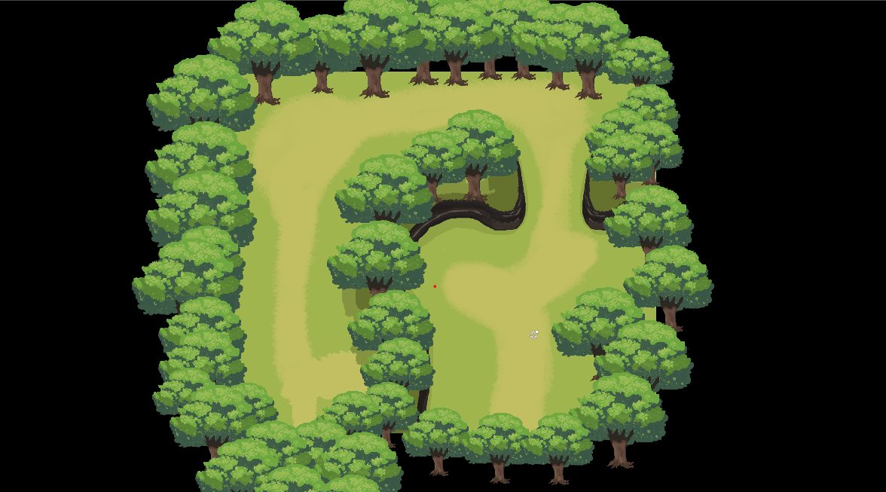
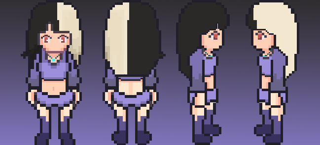

# 🔢 Math Warriors Prototype [Tentative Name!]

**Math Warriors** is a 2D turn-based strategy MOBILE game (BEED Thesis Project) in which players solve order‐of‐operations math problems (MDAS/PEMDAS) to progress through levels.  
*Please note: This is an early prototype—only screenshots are available, and the game is not yet playable. To playtest or review the build, please contact me, the developer directly.*

---

## 🎓 Authors of the Thesis
1. **Lynn Sophia Llegado**  
2. **Christian Vargas**  
3. **Jemar Alexopoulos**  

---

## 🕹️ Game Overview
- **Genre:** 2D Turn-Based Strategy / Educational  
- **Subject:** Order of Operations (MDAS/PMDAS/GEMDAS)  
- **Platform:** Mobile (currently under development; no playable build available)  

In **Math Warriors**, each turn presents you with a math expression. Correctly apply the order of operations (MDAS/PEMDAS/GEMDAS) to defeat enemies and advance to the next encounter. Enemies vary in difficulty and may require more complex OM (Order of Operations) reasoning.

---

## 🔧 Core Functionality (Working)
1. **Turn-Based Game Loop**  
   - Supports both **MDAS** and **PMDAS** rule sets.  
2. **Enemy Variety**  
   - Enemies differ by:  
     - Difficulty Level (Easy, Medium, Hard)  
     - Math Type (e.g., PEMDAS – Hard)  

---

## ⚠️ What’s Missing / Under Development
1. **Assets & Animation**  
   - Many character sprites, backgrounds, UI elements, and visual effects are still needed.  
2. **Gameplay Functionalities**  
   - Some core mechanics (e.g., Tutorial, level progression, UI polish, etc) are not yet implemented.  
3. **GEMDAS Implementation**  
   - Order of operations rules for **GEMDAS** (Grouping, Exponents, Multiplication, Division, Addition, Subtraction) are not yet integrated.

---

## 📷 Screenshots!

---

## 🚧 Development Status
> **Status:** Prototype / Thesis Stage  
> - Core turn-based loop and simple enemy interactions are implemented.  
> - Major features and polish pending.  

---

## 🤝 Acknowledgement
A special thanks to my beloved **Lynn Sophia Llegado** for recommending and ultimately hiring me to develop this software. Much love and appreciation for your support!

---

## 📄 License
This prototype is part of an academic thesis project. All rights reserved by the authors unless otherwise noted.  
